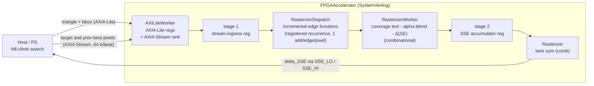

# FPGA-Accelerated Triangle Image Approximator

A hill-climbing image approximator: it rebuilds a target image from thousands of
semi-transparent triangles, keeping each proposal only if it lowers the error.
The per-proposal inner loop — rasterize a candidate triangle over its bounding
box, alpha-blend it onto the current best, and accumulate the change in
sum-of-squared-error against the target — is offloaded to a SystemVerilog
datapath. The search (RNG, proposal generation, accept/reject, canvas commits)
stays on the host. The RTL is verified in Python with cocotb, differentially
against the same C++ functions the software path uses as its golden model.



| property | value |
| --- | --- |
| pipeline depth | **2 registered stages**, beat -> result: stream-ingress capture in `AXILiteWorker`, then the squared-error accumulator in `RasterizerWorker` |
| between the stages | fully combinational: edge-function step, coverage test (`s_d0/1/2` same sign), integer alpha blend (`(b*(255-a)+tri*a)/255` via an `(x*32897)>>23` reciprocal), the `(t-c)² - (t-b)²` reduction, and the lane sum |
| edge-function front end | not a feed-forward stage — `RasterizerDispatch` holds the running edge values in registers and steps them one add per edge per pixel, aligned to the incoming beat, **no per-pixel multiplies** |
| throughput | 1 pixel / cycle / lane, initiation interval 1, stalls only on `render_ready` backpressure |
| setup | 1 cycle after a `CTRL.rst_render` pulse to latch the per-triangle edge origins and raise `render_ready` |
| datapath widths | 8-bit RGBA in, `s33_t` (signed 33-bit) edge functions, 64-bit signed SSE accumulator |
| not yet | a result-valid strobe — consumers currently count cycles (see [Known gaps](#known-gaps--loose-ends)) |

## Repository layout

| path | contents |
| --- | --- |
| `FPGA/` | SystemVerilog RTL, cocotb testbenches, and the `Makefile` sim harness |
| `src/` | C++ reference: naive + incremental rasterizer, `compute_SSE` / `compute_delta_SSE`, and the `triopt` optimizer |
| `bindings/` | `extern "C"` shim (`triopt_c.cpp`) exposing the C++ scoring path to Python via `ctypes` |
| `tests/` | C++ unit tests (doctest), image fixtures, and `render_dump.txt` (golden edge-function trace) |

## Hardware / software partition

| Software (host / PS) | Hardware (`FPGA/`) |
| --- | --- |
| hill-climb loop, proposal generation, accept/reject | per-pixel edge test, alpha blend, squared-error accumulate |
| holds the canonical canvas and target | streamed pixels + one scalar result |
| writes the candidate triangle + bbox, reads the result | `AXILiteWorker` register file + pixel-stream sink |

The hardware target is deliberately narrow: given a candidate triangle and its
bounding box, stream the target and previous-best pixels over that box and return
the scalar `delta_SSE`. Everything else stays in software.

---

# RTL design (`FPGA/`)

## `AXILiteWorker` — control + data interface

`FPGA/AXILiteWorker.sv` is the boundary block between the bus and the compute
datapath. It has two independent AXI interfaces plus a plain handshake to the
datapath:

- **AXI4-Lite worker** (32-bit) — the control plane. A CPU writes the candidate
  triangle and bounding box, kicks a render, and reads the 64-bit result back.
- **AXI4-Stream worker** (64-bit) — the data plane. Each beat carries one
  `{t_col, b_col}` pixel pair (`t_col` = `tdata[63:32]`, `b_col` = `[31:0]`);
  `tlast` marks the final pixel of the bounding box. `TSTRB`/`TKEEP` are not
  implemented — every beat is a full pixel pair.
- **Datapath ports** — `start` / `rst_render` (1-cycle pulses), `busy`/`done`
  inputs, `delta_sse[63:0]` input, and the decoded `triangle` / `max_coord`
  structs out. `pixel_valid` / `pixel_last` strobes accompany `t_col` / `b_col`;
  `render_ready` is the datapath's backpressure into the stream sink.

  As wired in `FPGAAccelerator.sv` today, the datapath is kicked by
  `rst_render` (it resets and re-primes the dispatch); `start` is decoded but
  the compute datapath has no `start` port and does not consume it, and
  `busy` / `done` are left undriven, so `STATUS.done` never asserts. The
  "poll `done`, then read `SSE_LO`/`SSE_HI`" flow is the intended contract,
  not the current behaviour — see [Known gaps](#known-gaps--loose-ends).

### Register map

Byte offset, 32-bit words. `RW` = written by the CPU and read by the datapath;
`RO` = driven by the datapath, read-only over the bus; `W1P` = write-1 pulses,
reads back 0.

| offset | name | dir | contents |
| --- | --- | --- | --- |
| `0x00` | `CTRL` | W1P | bit 0 -> `start` pulse, bit 1 -> `rst_render` pulse (both self-clearing) |
| `0x04` | `STATUS` | RO | bit 0 = `busy`, bit 1 = `done` (sticky, cleared by `start`) |
| `0x08` | `MAX_COORD` | RW | bounding-box max, `vertex_t` layout |
| `0x0C` | `TRI_V0` | RW | vertex 0, `vertex_t` layout |
| `0x10` | `TRI_V1` | RW | vertex 1 |
| `0x14` | `TRI_V2` | RW | vertex 2 |
| `0x18` | `TRI_COL` | RW | candidate colour, `color_t` layout |
| `0x1C` | `SSE_LO` | RO | `delta_sse[31:0]` |
| `0x20` | `SSE_HI` | RO | `delta_sse[63:32]` |

`SSE_LO` / `SSE_HI` are only coherent once `STATUS.done` is set; software
reads them after polling `done`. (Intended contract — `done` is not yet
driven; see [Known gaps](#known-gaps--loose-ends).)

### Packed types (`FPGA/common.sv`)

```
color_t    { logic [7:0] r, g, b, a }              // r = bits [31:24]
vertex_t   { logic [15:0] x, y }                   // x = bits [31:16]
triangle_t { color_t color; vertex_t [2:0] verts } // color is the MSBs
```

The register word layout for a vertex or colour matches the corresponding
struct field order, so the driver and testbench pack bytes the same way the
RTL unpacks them.

## `RasterizerDispatch` — edge-function front end

`FPGA/RasterizerDispatch.sv` is the first block of the compute datapath. It turns
the decoded `triangle` + `max_coord` from `AXILiteWorker` into the per-pixel
quantities `RasterizerWorker` needs, walking the bounding box in raster order and
emitting one set of edge-function values per pixel. It is the RTL port of
`RasterizeTriangleV2`'s incremental edge-function scheme (`src/rasterizer.cpp`).

**Inputs**: `triangle`, `max_coord` (bbox max, `(0,0)` min assumed), the
`pixel_valid` / `pixel_last` stream strobes, and the streamed `t_col` / `b_col`
pixel pair (per lane). **Outputs**, per lane: `s_d0` / `s_d1` / `s_d2` — the
three edge functions, `s33_t` = signed 33-bit — and `idx`, the linear pixel
index, plus `t_col_out` / `b_col_out` / `tri_col_out` forwarded straight
through. `render_ready` is the backpressure strobe back toward the stream sink.

### Two-phase operation

- **Precompute, once per triangle.** The per-edge step constants — `A0..A2`
  (vertex-pair `Δy`) and `B0..B2` (vertex-pair `−Δx`) — are plain combinational
  `assign`s off the vertices (they were registered in an earlier revision; that
  created a one-cycle stale-read hazard on the `d*_row` init and was removed).
  The edge-function value at the bbox origin, `d0_row..d2_row`, is registered
  one cycle after reset. Those origin values are the *only* multiplies in the
  block (six, and since this runs once per image they can be folded onto a
  single time-shared multiplier — the `TODO` in the source).
- **Per-pixel, incremental.** Each consumed pixel adds `A*` to the running edge
  value (`s_d*`) and bumps `idx`. End of row is detected a cycle ahead by
  `x + 1 >= max_coord.x`; on that boundary `x` wraps to 0 and the row
  accumulators step by `B*` instead. One add per edge per pixel, no multiplies.
  `y` is not tracked here — the stream master owns `max_coord.y` and end of
  packet.

`advance = pixel_valid && render_ready` gates every update, so the walk only
moves on cycles where a pixel is actually consumed.

The coverage test (`d0`, `d1`, `d2` all the same sign), the alpha blend, and the
squared-error accumulate are spec'd in the block comment for `RasterizerWorker`;
none of that is in this module.

### Multi-lane

`NUM_LANES` is a parameter for a future mode that processes several bbox rows in
parallel by giving each lane its own `d*` / `idx` offset. It is `1` everywhere
today; the per-lane loops are pass-throughs and lane routing is not implemented.

## `RasterizerWorker` — coverage test + blend + squared-error accumulate

`FPGA/RasterizerWorker.sv` is the compute stage downstream of `RasterizerDispatch`.
It consumes the per-pixel edge functions and colour triple and folds each
covered pixel into a running `delta_SSE`.

**Inputs**: the `pixel_valid` strobe, the three edge functions
`s_d0` / `s_d1` / `s_d2` (`s33_t`) and `idx` from `RasterizerDispatch`, and the
`t_col` / `b_col` / `tri_col` colour triple for that pixel. **Output**:
`sse_acc[63:0]` — the accumulated signed squared-error delta.

**Per pixel** (combinational except the accumulator):

- `in_tri` — the coverage test: `s_d0` / `s_d1` / `s_d2` all `>= 0` or all `<= 0`.
- `c_col` — the candidate colour after the integer alpha blend of `tri_col` over
  `b_col` (the previous-best pixel), `(b*(255-a) + tri*a)/255`. The `/255` is the
  `(x*32897) >> 23` magic multiply from `RasterizeTriangleV2`, done unsigned in
  the `udiv255` function — the numerator is always in `[0, 65025]`, so no sign
  handling is needed.
- `diff_* = b_col - c_col` and `sum_* = 2*t_col - b_col - c_col` per channel;
  `sse_acc += Σ diff*sum` on every `pixel_valid && in_tri`. Roles: `t_col` is the
  target/reference pixel, `b_col` the previous best, `c_col` the candidate. The
  product expands to `(t_col - c_col)² - (t_col - b_col)²` — the multiply-reduced
  Δ(squared error), three multiplies per pixel instead of six.

## `Rasterizer` / `FPGAAccelerator` — wrapper + top level

`FPGA/Rasterizer.sv` instantiates `RasterizerDispatch` and, per lane, a
`RasterizerWorker`, and sums the per-lane `sse_acc` into one `t_sse_acc[63:0]`.
`FPGA/FPGAAccelerator.sv` is the synthesis top: it wires `AXILiteWorker` to
`Rasterizer`, connecting the decoded `triangle` / `max_coord` and the pixel
stream in, and `t_sse_acc` back to the `SSE_LO` / `SSE_HI` registers as
`delta_sse`. The datapath reset is `s_axi_aresetn & ~rst_render`, so a
`CTRL` bit-1 write both clears the accumulator and re-primes the dispatch for a
new triangle.

`FPGA/PixelIndexer.sv` is a standalone raster-order coordinate generator with its
own testbench; it is not wired into the datapath yet.

---

# Verification (cocotb)

Every RTL block has a cocotb testbench in `FPGA/`, driven by `FPGA/Makefile`.
Bus traffic is generated by `cocotbext-axi` (`AxiLiteMaster` / `AxiStreamSource`
stand in for the CPU and DMA). Interface and datapath-facing tests run through
`@with_stalls`, which repeats each one four ways — no stalls, idle inserter,
backpressure inserter, and both — so handshakes are exercised under channel
pauses on every side.

## Running the testbenches

```
# one-time: Python deps
python -m venv .venv && . .venv/bin/activate
pip install cocotb cocotbext-axi

# one-time: build the C++ bridge the full-datapath tests call
cmake -S . -B build && cmake --build build --target triopt_c

cd FPGA
make                       # default DUT (axil), Icarus
make fpga_accel            # full datapath, differential vs the C++ golden model
make render_dispatch       # or: axil, render_worker, pixel_indexer
make render_worker SIM=verilator   # any target under Verilator
make lint                  # verilator --lint-only over all RTL
make fpga_accel WAVES=1    # + FST/VCD dump; `make waves DUT=fpga_accel` opens it
```

## Golden models

Three reference mechanisms, weakest to strongest:

1. **Python `Color` model** (`FPGA/common.py`) — `Color.rasterize` for the blend,
   `Color.delta_SSE` for the per-pixel error. Hand-written mirror of the RTL;
   used by the `RasterizerWorker` unit tests. Shares the risk that a bug in the
   mental model shows up in both the model and the RTL and cancels out.
2. **C++ edge-function trace** (`tests/data/render_dump.txt`) — `(idx, d0, d1,
   d2)` tuples emitted by `RasterizeTriangleV2` built with `-DTRIOPT_DUMP=ON`
   (`dump.sh`, via the `Dump Triangles` ctest case). Used by the
   `RasterizerDispatch` tests to check the edge-function walk pixel-for-pixel.
3. **C++ scoring path via `ctypes`** (`FPGA/triopt_ref.py` ->
   `bindings/triopt_c.cpp`, built as `libtriopt_c` by
   `cmake --build build --target triopt_c`) — calls the real
   `RasterizeTriangleV2` and `compute_delta_SSE`. Used by
   `test_fpga_accelerator.py` to diff the full datapath's `t_sse_acc` against the
   exact function the optimizer scores with. This is an independent
   implementation, not a mirror — it caught a blend applied to the wrong operand
   that the `RasterizerWorker` unit test had passed, because that test's Python
   model had the same bug.

## Test inventory

### `AXILiteWorker` — `test_axil.py` (`make axil`)

| test | checks |
| --- | --- |
| `write_read_all_regs` | write a distinct value to every RW register, read them all back (write-all-then-read-all catches cross-register clobber) |
| `reset_regs` | write the RW registers, pulse reset, confirm all read 0 |
| `write_delta_sse_and_read` | drive the 64-bit `delta_sse` input, read `SSE_LO`/`SSE_HI`, reassemble and compare |
| `passthough_packing` | write the vertex / colour / bbox registers, check the `triangle` and `max_coord` output structs carry the expected packed value |
| `ctrl_start_pulse` | write `CTRL` bit 0, assert `start` is high exactly one cycle and `CTRL` reads back 0 |
| `pixel_stream_data` | feed deterministic 64-bit beats on the stream port, capture `{t_col, b_col}` on `pixel_valid`, compare each to what was sent |
| `pixel_stream_data_backpressure` | same, toggling `render_ready` to confirm no beats are dropped under stream backpressure |
| `partial_writes` | skipped — `WSTRB` sub-word writes are out of scope (the driver issues full 32-bit words) |

### `RasterizerDispatch` — `test_render_dispatch.py` (`make render_dispatch`)

A `monitor` coroutine samples `idx` / `s_d0` / `s_d1` / `s_d2` on every
`pixel_valid` cycle and compares the captured beats against
`render_dump.txt`, so the RTL edge-function walk is differentially tested
against the same V2 rasterizer that is the C++ golden model.

| test | checks |
| --- | --- |
| `single_row_test` | one 5×5 triangle, first bbox row only; assert the first 4 beats match the dump |
| `multi_row_test` | same triangle, full 5×5 bbox; assert every captured beat matches the dump, in order |

### `RasterizerWorker` — `test_render_worker.py` (`make render_worker`)

Reference is the Python `Color` model.

| test | checks |
| --- | --- |
| `per_pixel_sse` | 50 random `t_col` / `b_col` / `tri_col` triples (seed `0xC0FFEE`); one clock after driving each, assert the combinational `px_sse` wire equals `Color.delta_SSE(t_col, b_col, Color.rasterize(b_col, tri_col))` |
| `accumulator` | streams the same 50 triples, one per cycle, with `pixel_valid` held high; a `monitor` samples `sse_acc` on every `pixel_valid` edge, and the last sample must equal the running sum of the per-pixel deltas |

The `in_tri` coverage gate is not exercised here (both tests leave `s_d0` /
`s_d1` / `s_d2` at 0, so `in_tri` is always true); it is covered at the
integration level by `CPP_bindings_random_triangle`. The `sse_acc` reset value
and the `idx` port are still unchecked at unit level.

### `FPGAAccelerator` — `test_fpga_accelerator.py` (`make fpga_accel`)

First testbench that runs the full interface -> dispatch -> worker path, and the
first to differentially test against the C++ scoring path via the `ctypes`
bridge.

| test | checks |
| --- | --- |
| `count_sse_pos` / `count_sse_neg` / `large_sse` | fixed 5×5 corner triangle, all-zero pixel stream; assert `t_sse_acc` equals the closed-form `±N(N+1)/2` (scaled) coverage count |
| `CPP_bindings` | same corner triangle, drive it through the C++ bridge and the RTL, assert equal `delta_SSE` |
| `CPP_bindings_random_colors` | corner triangle, **random** target / prev-best images and triangle colour (seeded); 10 trials, each diffed against `compute_delta_SSE` |
| `CPP_bindings_random_triangle` | as above but a random triangle shape; `max_coord` derived from `tri.bounds()`, pixels streamed in the dispatch's `max_coord.x`-wide raster order |

---

# Status

RTL exists for the whole scoring datapath — `AXILiteWorker`,
`RasterizerDispatch`, `RasterizerWorker`, the `Rasterizer` wrapper, and the
`FPGAAccelerator` top — each with a cocotb testbench, and the top-level path is
differentially tested against the C++ golden model. This is a semi-final RTL
snapshot: the datapath computes the right number, but the control/completion
handshake around it is not finished and there is no synthesis data.

## Known gaps / loose ends

**Completion signalling (biggest).** There is no valid qualifier on the result.
`delta_sse` / `t_sse_acc` is combinational and always live; `busy` / `done` are
undriven in `FPGAAccelerator.sv`, so `STATUS.done` never asserts. Every
testbench works around this by clocking a fixed `N*N + 3` cycles after the last
pixel and reading `t_sse_acc` directly — a magic number that holds only for
`N = 5` on a stall-free stream. Needs an `sse_valid` / `done` strobe
propagated dispatch → worker → register file, matched to the datapath's
pipeline depth.

**`start` vs `rst_render`.** The datapath is kicked by `rst_render` (which
resets it). `start` (CTRL bit 0) is decoded but unused, and `STATUS` is built
around a `start`/`busy`/`done` model that isn't wired. Pick one contract.

**Dispatch priming.** `rst_render` is a 1-cycle pulse; `render_ready` asserts
one cycle after reset. With `A*/B*` now combinational the precompute is
nominally one cycle, but the alignment of `render_ready` with `s_d*` validity
is not proven — add an explicit prime counter or a directed test.

**Worker accumulate gate.** `RasterizerWorker` accumulates on
`pixel_valid && in_tri`, not `&& render_ready`, while the dispatch's `advance`
does gate on `render_ready`. During the prime cycle they can disagree and
double-count the first pixel; current test sequencing hides it.

**Dispatch does not stop at the bbox.** `y` is not tracked and `pixel_last` /
`tlast` is not consumed. If the stream master feeds more than
`max_coord.x * max_coord.y` beats, the walk runs past the bottom row and the
worker may accumulate phantom pixels. Stream length correctness is entirely on
the master.

**Stream raster order.** The driver must emit pixels in the dispatch's
`max_coord.x`-wide raster order, not the image's width — the dispatch assigns
coordinates from its own counter. `_pack_pixel` / the stream loop in the
testbench encode this; a real DMA path would need the same.

**Degenerate triangles.** `CPP_bindings_random_triangle` can generate
zero-area / collinear triangles; RTL-vs-C++ agreement there is unverified.

**Multi-lane.** `NUM_LANES` is a parameter only; the per-lane loops are
pass-throughs and lane routing is unimplemented.

**`PixelIndexer`.** `FPGA/PixelIndexer.sv` (raster-order coordinate generator)
is standalone with its own testbench; it is not instantiated in the datapath.

**No synthesis / timing / resource / power numbers, and no measured
hardware-vs-CPU comparison.** Structural note only: at one lane the datapath
consumes one pixel per cycle, so a worst-case full-frame 256×256 bounding box
is 65536 cycles (~655 µs at 100 MHz). That is arithmetic from the architecture,
not a benchmark; typical bounding boxes are far smaller, and the CPU path
already only scans the bbox.

---

# Software baseline (`src/`)

The C++ implementation is the reference the hardware is built against: a naive
rasterizer and SSE that stay the permanent golden model, plus the optimizer loop
that would call the accelerator. `RasterizeTriangle` (naive, fresh cross product
per pixel) is never replaced; `RasterizeTriangleV2` (incremental edge functions,
the scheme the RTL ports) must stay byte-identical to it on every input.

## Build and test

```
cmake -S . -B build          # Release by default; benchmark numbers assume it
cmake --build build
ctest --test-dir build --output-on-failure
```

`ctest` (doctest, one binary, discovered per `TEST_CASE`) covers `compute_SSE`
and `compute_delta_SSE` (including the delta/full-rescan identity), the
rasterizer (pixel coverage, alpha blending, degenerate triangles, `V2 matches
V1`), and PNG load/save round-tripping.

## Optimizer CLI

```
./build/triopt <target.png> <output.png> [iterations] [seed] [patience]
./build/triopt tests/mona_lisa_256.png out.png 100000 1
```

Fixed seed `1` and the committed `tests/mona_lisa_256.png` fixture make runs
reproducible: same seed + iteration budget must produce an identical SSE
trajectory (the per-commit `best_sse` values on stderr), regardless of which
scoring path is compiled in. A changed trajectory means a scoring change is not
bit-exact. `test.sh` automates this — several runs at seed `1` / 8000
iterations, asserts every run hits the same final SSE, reports wall-time stats.

## Baseline optimizations (measured, single-variable A/B)

### `golden-model` vs `delta-ssh-model`

| tag | scoring | order |
| --- | --- | --- |
| `golden-model` | full `compute_SSE` rescan every proposal | O(W*H) |
| `delta-ssh-model` | `best_sse + compute_delta_SSE(...)` over the triangle bbox | O(bbox) |

**Equivalence.** At seed `1` both reach final SSE `54798669` at 8000 iterations,
and the 100000-iteration output PNG is byte-identical (integer squared-error
deltas, no rounding). `ctest` is 15 cases on `golden-model`, 16 on
`delta-ssh-model` (the extra asserts `compute_SSE(target, cand) ==
compute_SSE(target, prev) + compute_delta_SSE(target, prev, cand, bbox)`).

**Wall time**, `tests/mona_lisa_256.png`, seed `1`, Release, one machine:

| proposals | `golden-model` | `delta-ssh-model` | speedup |
| --- | --- | --- | --- |
| 8000 | 679 ms (median of 5) | 645 ms | 1.05x |
| 100000 | 4800 ms (median of 3) | 2897 ms | 1.66x |

The speedup grows with proposal count: bounding boxes shrink as triangles refine,
so the delta scan cost falls while the full rescan stays flat. The remaining
per-proposal O(W*H) cost is the `ImageData trial = best` copy.

### `RasterizeTriangle` vs `RasterizeTriangleV2`

`RasterizeTriangleV2` computes the three edge functions with running sums (one
add per pixel per edge) instead of a fresh cross product per pixel — same integer
blend, same corner-sampled coverage rule, byte-identical output.

**Equivalence.** `ctest` includes `RasterizeTriangleV2: V2 matches V1`
(rasterize the same triangle set with both, assert identical pixels). Swapping V2
into the optimizer leaves the seed-`1` / 8000-iteration final SSE at `54798669`.

**Wall time**, `tests/mona_lisa_256.png`, seed `1`, 8000 proposals, Release,
one machine, commit `f9b9f8e`, median of 5:

| scoring-path rasterizer | wall time | speedup |
| --- | --- | --- |
| `RasterizeTriangle` (V1) | 641 ms | 1.00x |
| `RasterizeTriangleV2` | 476 ms | 1.35x |

A/B on one commit with only the rasterize call swapped, so the ~165 ms is V2's
effect alone. Whole-optimizer wall time, not an isolated microbenchmark — V2's
share of the win tracks how many pixels the proposals cover, large early and
shrinking as triangles refine. Not comparable to the `golden` / `delta` table
(that varies the SSE scan, this varies the rasterizer); those numbers predate
this swap.
